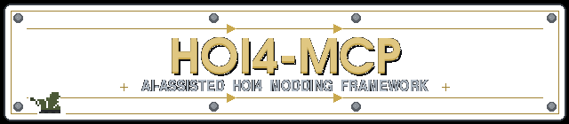

<div align="center">
  
</div>

<table align="center" border="0" cellpadding="6" cellspacing="0">
  <tr>
    <td align="center" valign="middle" width="150">
      
    </td>
    <td align="center" valign="middle">
      
      <br/>
      <sub><b>MCP server</b> • <b>Agent skills</b> • <b>Clausewitz parser</b> • <b>Adaptive learning</b></sub>
      <br/>
      <sub>Turns any AI coding assistant into a Hearts of Iron IV modding expert — deterministic data, zero hallucinations, compounding knowledge.</sub>
    </td>
    <td align="center" valign="middle" width="150">
      
    </td>
  </tr>
</table>

<div align="center">
  
  
  
  
  <br/>
  
  <br/>
  
  
  
  
  
  
</div>

---

### The Problem

When an AI helps you mod HOI4, it wastes enormous context on:
- Searching 50+ event files to find your namespace
- Reading focus trees one by one to check for ID collisions
- Hallucinating vanilla IDs (`GER_drive_to_the_west` vs real `GER_drives_to_the_west`)
- Waiting for you to run the game, check `error.log`, and paste errors back
- Miscounting brackets `{}` in complex Clausewitz scripts
- **Making the same mistakes across every session — with no memory of past corrections**

**This framework replaces ALL of that.** One MCP tool call. Deterministic results. Permanent learning.

---

### Languages and Tools

<div align="center">
  
</div>

---

### Architecture

```
┌──────────────────────────────────────────────────────────┐
│                    AI Agent Layer                         │
│  ┌─────────────────────┐  ┌───────────────────────────┐  │
│  │ hoi4-modder.agent.md│  │ SKILL.md (syntax ref)     │  │
│  │ (persona, workflow) │  │ (focuses, events, ideas…) │  │
│  └─────────────────────┘  └───────────────────────────┘  │
│  ┌───────────────────────────────────────────────────┐   │
│  │ .agents/skills/ (10 domain design guides)         │   │
│  └───────────────────────────────────────────────────┘   │
├──────────────────────────────────────────────────────────┤
│                 MCP Server Layer                          │
│  ┌───────────────────────────────────────────────────┐   │
│  │ FastMCP Server — 13 tools + 2 resources           │   │
│  │ • get_mod_index     • get_learned_rules           │   │
│  │ • search_mod        • record_mistake              │   │
│  │ • validate_syntax   • resolve_mistake             │   │
│  │ • lookup_vanilla    • export_learned_rules         │   │
│  │ • get_next_id       • import_learned_rules         │   │
│  │ • check_id_exists   • get_latest_errors            │   │
│  │ • generate_province_rgb                            │   │
│  └───────────────────────────────────────────────────┘   │
│  ┌──────────────┐ ┌──────────────┐ ┌────────────────┐   │
│  │ clausewitz/  │ │ tools/       │ │ learning/      │   │
│  │ parser.py    │ │ indexer.py   │ │ db.py          │   │
│  │ validator.py │ │ id_mgr.py    │ │ rules.py       │   │
│  │              │ │ error_log.py │ │ detector.py    │   │
│  │              │ │ report.py    │ │ seeder.py      │   │
│  └──────────────┘ └──────────────┘ └────────────────┘   │
├──────────────────────────────────────────────────────────┤
│                 Data Layer                                │
│  ┌──────────────────────┐  ┌────────────────────────┐    │
│  │ paradox_wiki/        │  │ ~/.hoi4_mcp/            │    │
│  │ (30+ offline refs)   │  │ vanilla.db +            │    │
│  │                      │  │ learned_rules.db        │    │
│  └──────────────────────┘  └────────────────────────┘    │
└──────────────────────────────────────────────────────────┘
```

---

### MCP Tools

| Tool | Category | Description |
|------|----------|-------------|
| `get_mod_index` | Mod | Complete JSON map of entire mod — one call replaces 10+ searches |
| `search_mod` | Mod | Fast text search across all mod files with pattern matching |
| `get_next_id` | Mod | Next safe numeric ID for events/focuses/decisions/characters |
| `check_id_exists` | Mod | Verify an ID isn't already used (prevents silent overwrites) |
| `validate_syntax` | Validation | Clausewitz bracket matching + YML validation before game launch |
| `get_latest_errors` | Debug | Structured error.log parsing — 11 error categories, recurring pattern detection |
| `lookup_vanilla` | Reference | Exact vanilla focus/event/idea/tech/character/modifier data from SQLite |
| `generate_province_rgb` | Map | Find unused RGB colors for new map provinces |
| `get_learned_rules` | Learning | Retrieve rules learned from past mistakes — **mandatory pre-flight** |
| `record_mistake` | Learning | Record a correction as a permanent rule for future sessions |
| `resolve_mistake` | Learning | Mark a rule as inactive (game patch, design change) |
| `export_learned_rules` | Learning | Export rules as `.jsonl` for team sharing via git |
| `import_learned_rules` | Learning | Import shared rules on fresh setups |

---

### Adaptive Learning System

The framework **learns from every mistake** — the highest-impact feature (GAP-000).

```
Agent makes mistake → self-corrects → record_mistake()
                                          ↓
Next session: get_learned_rules() → rule loaded → mistake PREVENTED
```

- **8 seed rules** bootstrapped from proven HOI4 modding constraints
- **Deduplication** via Jaccard token-overlap similarity — no ML dependencies
- **Dual-source capture**: agent self-corrections + human corrections
- **Recurring pattern detection** from game error logs
- **`.jsonl` export** for team sharing via git — one rule per line, diff-friendly

---

### 📖 Documentation

| Page | Contents |
|------|----------|
| **[Setup Guide](docs/SETUP.md)** | Prerequisites, installation, vanilla DB build, VS Code config, troubleshooting |
| **[Usage Guide](docs/USAGE.md)** | Tool reference, common workflows, agent integration, skill loading, testing |
| **[Test Results](TEST-RESULTS.md)** | Comprehensive benchmarks across 6 reference mods + vanilla game |

---

### ✅ Verified Against

| Mod | Size | Index | Events | Loc Keys | Errors |
|-----|------|-------|--------|----------|--------|
| Parliament GUI | 196K | <0.1s | 0 | 12 | 0 |
| Global Market | 2.8M | 0.4s | 16 | 638 | 0 |
| Greater Macedonia | 17M | 0.2s | 0 | 5,163 | 0 |
| Toolpack | 14M | 0.7s | 5 | 1,045 | 0 |
| Old World Blues | 3.6G | 21.4s | 1,360 | 124,607 | 0 |
| Kaiserreich | 1.2G | 51.0s | 19,558 | 252,105 | 0 |
| **Vanilla 1.19.x** | — | ~60s | **40,040** | — | 0 |

**101 automated tests passing. All 6 reference mods index with zero errors.**  
See **[TEST-RESULTS.md](TEST-RESULTS.md)** for full breakdown.

---

### Quick Start

See **[docs/SETUP.md](docs/SETUP.md)** for detailed instructions. Quick version:

```bash
cd hoi4-mcp-server && pip install -e .
index-vanilla --vanilla-path "/path/to/Hearts of Iron IV"
# Add mcp.json config → Reload VS Code → Done
```

Full setup walkthrough, CLI reference, troubleshooting: **[docs/SETUP.md](docs/SETUP.md)**  
Tool reference, workflows, agent integration: **[docs/USAGE.md](docs/USAGE.md)**

---

### Project Structure

```
HOI4-MCP/
├── hoi4-modder.agent.md         # AI agent persona + 4-phase workflow
├── SKILL.md                     # HOI4 syntax reference (18 systems, 1,800+ lines)
├── AGENTS.md                    # Project-wide conventions
├── TEST-RESULTS.md              # Benchmarks across 6 reference mods
├── docs/                        # Documentation
│   ├── SETUP.md                 # Setup guide
│   └── USAGE.md                 # Usage guide
├── .agents/
│   ├── skills/                  # 15 domain design guides
│   └── checklists/              # 16 platform-agnostic audit checklists
├── .codex/agents/               # 16 Codex-specific subagent definitions
├── hoi4-mcp-server/
│   ├── src/hoi4_mcp/
│   │   ├── server.py            # FastMCP — 14 tools + 2 resources
│   │   ├── clausewitz/          # Tokenizer, parser, validator
│   │   ├── tools/               # Indexer, ID manager, error log, packager, report
│   │   ├── db/                  # Vanilla HOI4 → SQLite (40K events, 5.6K focuses)
│   │   └── learning/            # Adaptive mistake memory (14 seed rules)
│   ├── tests/                   # pytest — 101 tests in 0.18s
│   └── scripts/setup.sh
└── paradox_wiki/                # 30+ offline reference pages + INDEX.md
│   └── hoi4-text-audio-research/
├── hoi4-mcp-server/
│   ├── src/hoi4_mcp/
│   │   ├── server.py            # FastMCP server — 13 tools + 2 resources
│   │   ├── clausewitz/          # Clausewitz .txt tokenizer, parser, validator
│   │   ├── tools/               # Mod indexer, ID manager, error log, HTML report
│   │   ├── db/                  # Vanilla HOI4 → SQLite builder + query
│   │   └── learning/            # Adaptive mistake memory system
│   ├── tests/                   # pytest suite (56 tests for learning module)
│   ├── scripts/setup.sh         # One-time setup + auto-detect HOI4 paths
│   └── pyproject.toml
└── paradox_wiki/                # 30+ offline Paradox wiki snapshots
```

---

### Requirements

- Python 3.10+
- `mcp[cli]>=1.0.0` + `pyyaml>=6.0`
- HOI4 mod directory (for mod tools)
- HOI4 game install (for vanilla database — recommended)

---

### Current Focus

- Expanding syntax reference coverage for remaining HOI4 modding systems
- Converting Codex-specific subagent patterns to platform-agnostic checklists
- Adding multi-mod workspace switching to the MCP server
- Building CI/CD pipeline with automated testing
- Extracting subagent knowledge into cross-platform checklists for DeepSeek, Claude, Z.AI

---

### Acknowledgments

This project is built upon the foundational work of **[Agentic-HOI4-Modding](https://github.com/klimPaskov/Agentic-HOI4-Modding)** by [klimPaskov](https://github.com/klimPaskov), which pioneered the concept of using AI agents with MCP servers for Hearts of Iron IV modding. The original project established the core patterns for deterministic mod data access, vanilla game lookups, and agent-assisted mod development that this project extends with syntax validation, adaptive learning, and expanded tool coverage.

---

<div align="center">

### Links

[Project Audit](PROJECT-AUDIT.md)
•
[Agent Prompt](hoi4-modder.agent.md)
•
[Syntax Reference](SKILL.md)
•
[MCP Server](hoi4-mcp-server/)

</div>
